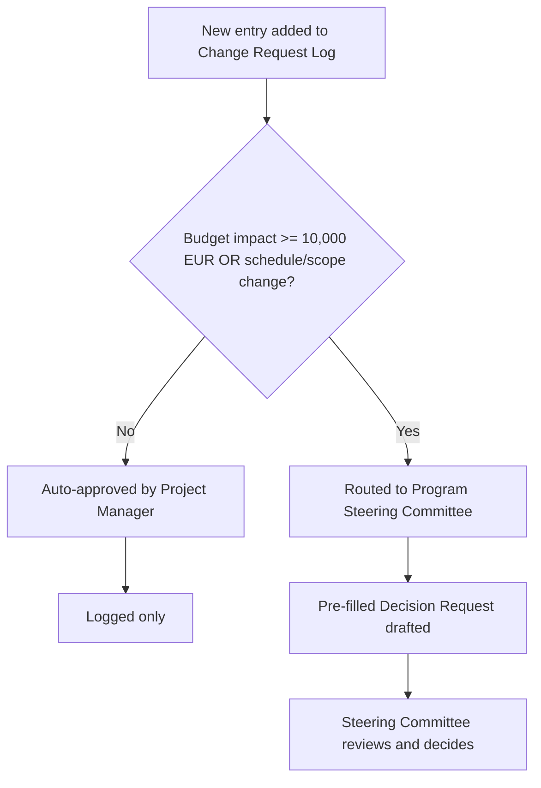

# Automation: Change Request Routing

**Introduced:** Month 5 (following Decision 001)
**Owner:** Project Manager

## Trigger
A new entry is added to `05 Controls/Change Request Log.xlsx`.

## Logic
Routes based on estimated impact recorded at submission:
- **Budget impact < €10,000 and no schedule change** → auto-approved by Project Manager, logged only
- **Budget impact ≥ €10,000, or any schedule/scope change** → routed to Program Steering Committee for review, using the Decision Request template

## Output
Automatic notification to the correct approver, with the change request pre-filled into either an approval log entry or a Decision Request draft.

## Flowchart

## Why It Matters
This rule was introduced directly after Decision 001 (the migration budget change), where the ad hoc escalation process took longer than necessary to reach the Steering Committee. A standing routing rule removes that delay for future changes.

## Related
`05 Controls/Change Request Log.xlsx`, `06 Communications/Templates/Decision Request.md`, `09 Decisions/001 Budget Change Due to Migration Complexity.md`
