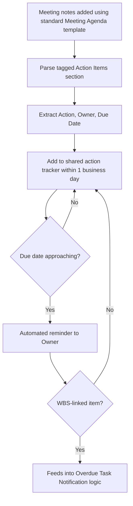

# Automation: Meeting Action Tracking

**Introduced:** Month 7
**Owner:** Project Manager

## Trigger
Meeting notes are added to the project's meeting notes folder following a working session or steering committee meeting.

## Logic
Structured meeting notes (using the standard `06 Communications/Templates/Meeting Agenda.md` / notes format) include a tagged "Action Items" section. This section is parsed and each item is added to a running action tracker with owner, due date, and source meeting reference.

## Output
Action items appear in the shared action tracker within one business day of the meeting, with automated reminders sent to owners as due dates approach (feeding into the same logic as `Overdue Task Notification.md` for anything WBS-linked).

## Flowchart

## Why It Matters
Action items raised in meetings were previously tracked inconsistently across individual notes, making follow-through hard to verify. Centralizing capture closes that gap.

## Related
`06 Communications/Templates/Meeting Agenda.md`, `07 AI Augmented PM/Meeting Notes to Actions.md`
