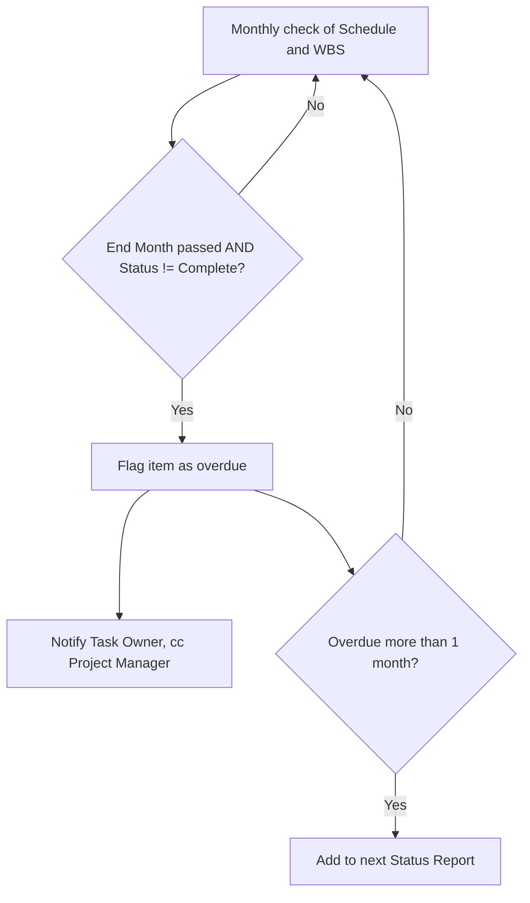

# Automation: Overdue Task Notification

**Introduced:** Month 5
**Owner:** Project Manager

## Trigger
A task or milestone in `02 Planning/Schedule And WBS.xlsx` passes its End Month while Status remains anything other than "Complete."

## Logic
Monthly check comparing the current program month against each WBS item's End Month and Status fields.

## Output
Automated summary sent to the task Owner and cc'd to the Project Manager, listing overdue items. Items overdue by more than one full month are additionally flagged in the next status report.

## Flowchart

## Why It Matters
With work distributed across regional leads and workstream owners, overdue items could otherwise go unnoticed until a monthly steering review — this closes that gap between occurrence and visibility.

## Related
`02 Planning/Schedule And WBS.xlsx`, `05 Controls/Status Reports/`
