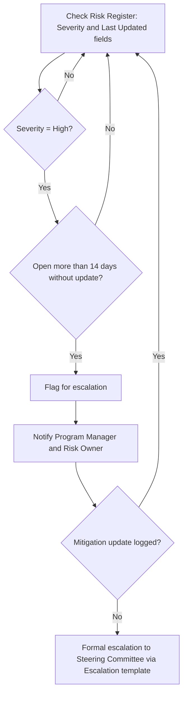

# Automation: Risk Escalation Trigger

**Introduced:** Month 4 (program setup)
**Owner:** Program Manager

## Trigger
A risk in `02 Planning/RAID Log.xlsx` is marked "High" severity and remains "Open" for more than 14 days without a logged mitigation update.

## Logic
Automated check against the Risk Register's Severity and Status/last-updated fields. Any risk meeting both conditions is flagged for escalation.

## Output
Automated notification to the Program Manager and the risk's Owner, prompting either a mitigation update or formal escalation to the Program Steering Committee via the escalation email template.

## Flowchart

## Why It Matters
Prevents high-severity risks from silently aging without action — a common failure mode in programs with a large, distributed risk register across multiple regions and workstreams.

## Related
`02 Planning/RAID Log.xlsx`, `06 Communications/Templates/Escalation.md`
