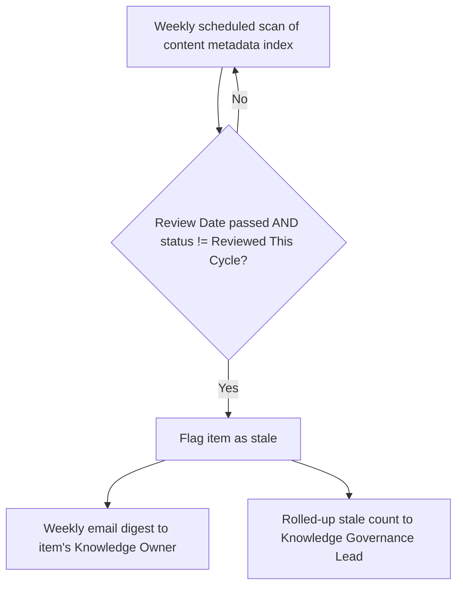

# Automation: Stale Content Alerts

**Introduced:** Month 9 (following Migration Wave 1 lessons)
**Owner:** Knowledge Governance Lead

## Trigger
A content item's "Review Date" (metadata field) passes without the item being reviewed and re-approved.

## Logic
Weekly scan of the content metadata index. Any item where `today > review_date` and `status ≠ Reviewed This Cycle` is flagged.

## Output
Automated email digest sent weekly to the item's designated Knowledge Owner, listing their stale items with direct links, plus a rolled-up count sent to the Knowledge Governance Lead for firm-wide visibility.

## Flowchart

## Why It Matters
Manually tracking review dates across thousands of documents was identified as unsustainable during the knowledge audit. This automation keeps the content lifecycle (`Create → Review → Approve → Publish → Use → Review Date → Update/Archive`) enforceable without a dedicated headcount for policing it.

## Related
`03 Delivery/Quality/Quality Management Plan.md` (stale/duplicate content review activity)
