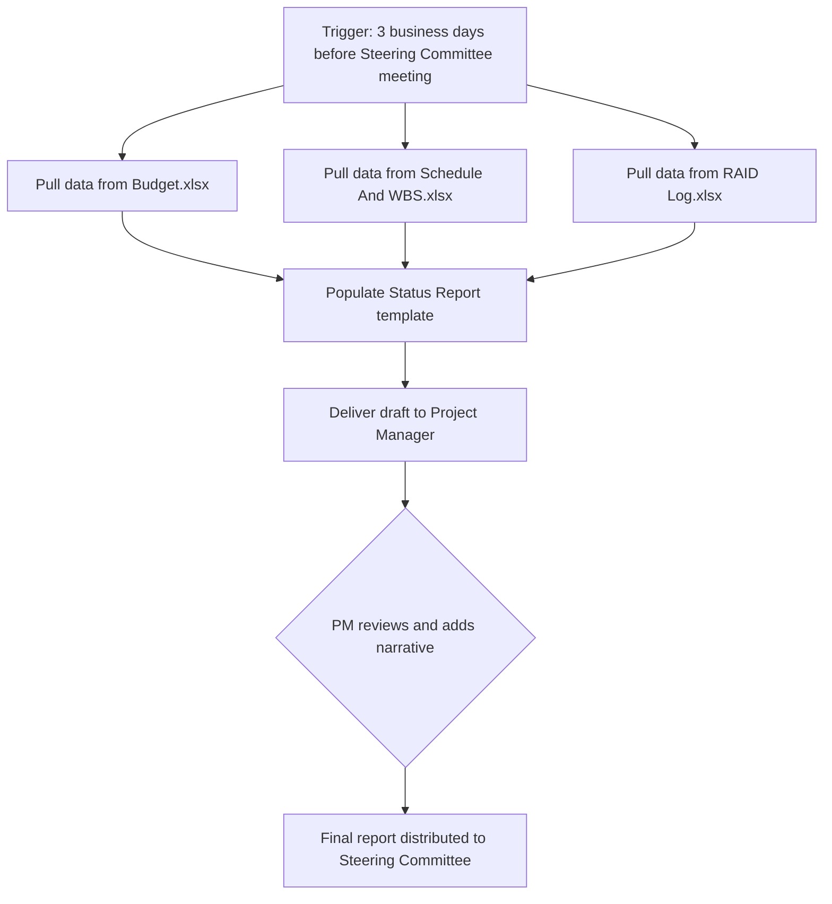

# Automation: Status Report Auto-Generation

**Introduced:** Month 6
**Owner:** Project Manager

## Trigger
Runs three business days before each monthly Program Steering Committee meeting.

## Logic
Pulls current values from `02 Planning/Budget.xlsx` (spend vs. baseline), `02 Planning/Schedule And WBS.xlsx` (milestone completion), and `02 Planning/RAID Log.xlsx` (open risks/issues by severity), and populates a draft status report using the `06 Communications/Templates/Status Report.md` template structure.

## Output
A pre-filled draft status report delivered to the Project Manager for review, narrative additions, and sign-off before distribution — this automation drafts the data-driven sections; it does not replace PM judgment on framing or narrative.

## Flowchart

## Why It Matters
Reduces the manual effort of re-compiling the same tracker data into a report format every month, and reduces the risk of the status report drifting out of sync with the live trackers.

## Related
`06 Communications/Templates/Status Report.md`, `07 AI Augmented PM/Status Report Prompt.md`
